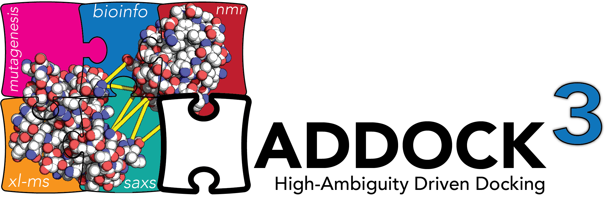

# Installation

* Requirements
    * Python 3.7.x

## Install haddock3
```bash
$ virtualenv-3.7 haddock3
$ cd haddock3
$ source bin/activate
$ mkdir src
$ cd src
$ git clone https://github.com/brianjimenez/haddock3.git
$ cd haddock3
$ pip install -r requirements.txt
```

## Install CNS

Download from [CNS 1.31 UU](https://surfdrive.surf.nl/files/index.php/apps/files/?dir=/Shared/HADDOCK/CNS&fileid=5041663829) repository the appropriate version for your architecture. Once downloaded, place the binary in `bin/cns` folder of your haddock3 installation.

Edit the CNS binary path in `etc/haddock3.json` file:

```json
"default": {
        "haddock3": "",
        "cns_exe": "bin/cns/cns_solve-1.31-UU-MacIntel.exe"
    }
```

# Execution

```bash
$ cd haddock3
$ source bin/activate
$ cd src/haddock3
$ source bin/activate_haddock
$ haddock3.py
```

## Example

```bash
$ cd haddock3
$ source bin/activate
$ cd src/haddock3
$ source bin/activate_haddock
$ haddock3.py haddock/test/modules/scoring/golden/scoring.toml
```

